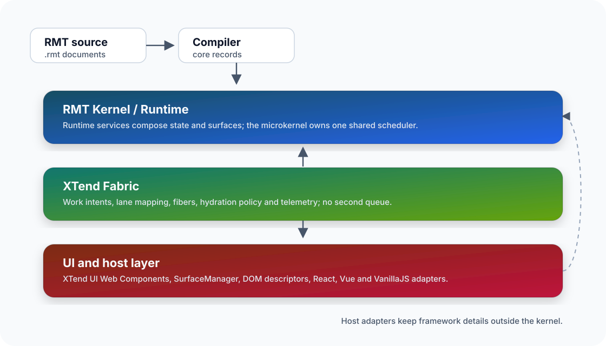

# RMT Stack-Topographie

Die RMT Stack-Topographie erklärt, wie RMT Source, Compiler, Kernel, Fabric und UI-Schichten zusammenspielen. Sie hilft dir, XTendRMT nicht nur als Dokumentensprache zu lesen, sondern als Baustein für größere Anwendungen einzuordnen.



## Schichten

Der RMT Source beschreibt App-Struktur, State, Selectors, Actions, Events, Resources, Surfaces und Scheduling-Absicht. Der Compiler übersetzt diese Beschreibung in stabile Core Records.

Der RMT Kernel verarbeitet diese Records host-neutral. Er plant Arbeit, verwaltet Runtime-State, löst Actions aus, publiziert Diagnostics und bleibt unabhängig von DOM, CSS und Frameworks.

XTend Fabric übersetzt Scheduling-Absicht in Lanes, Hydration-Entscheidungen, Telemetrie und Backpressure-Signale. Host Adapter verbinden diese Signale mit Browser, Server, Worker oder App Shell.

XTend UI, React, Vue oder VanillaJS rendern am Rand des Systems. Sie erhalten Props, Attribute, Slots, Events und Hydration-Aufträge über Adapter und bleiben dadurch austauschbar.

## Integrationsmodelle

Im XTend-only-Modell beschreibt RMT die App Shell, Fabric koordiniert die Arbeit und XTend UI rendert die sichtbaren Web Components.

Im MFE-Modell kann eine XTend Shell Surfaces für andere Teams bereitstellen. Diese Surfaces können XTend UI, React, Vue oder VanillaJS nutzen, solange sie über klare DOM- und Adapter-Grenzen angebunden werden.

Im Scheduler-Modell läuft der RMT Kernel als orchestrierende Schicht neben bestehenden Frontends. Dann nutzt die App RMT für State, Aktionen, Ressourcen und Scheduling, während die konkrete UI weiterhin in einem vorhandenen Framework entsteht.

## Nächste Schritte

- [RMT Kernel Runtime](./rmt-kernel-runtime.md)
- [XTend Fabric Runtime](./xtend-fabric-runtime.md)
- [XTend UI Runtime-Schicht](./xtend-ui-runtime-layer.md)
- [XTendRMT Runtime Bridge](./xtendrmt-runtime-bridge.md)

## Entwicklerkontext

Dieser erweiterte Abschnitt macht aus RMT Stack-Topographie einen praktischen RMT Runtime-Leitfaden für Drittanbieter. Lies ihn als öffentlichen Vertrag rund um das Thema: Er erklärt, warum die Seite existiert, welche Repository-Oberflächen sie stützen, wie ein Host sie integrieren sollte und wo du nachsiehst, wenn sich das Verhalten nicht wie erwartet zeigt. Die Struktur folgt etablierten Entwicklerdokumentationen: kurzer Kontext, wiederholbarer Integrationspfad, konkretes Beispiel, Referenz-Checkliste und Fehlerbehebung.

Nutze diese Seite, wenn du eine Implementierungsentscheidung treffen musst, ohne internes Projektwissen vorauszusetzen. Die Seite soll drei Fragen schnell beantworten: Was ist stabil, was muss der Host konfigurieren, und welche lokale Prüfung beweist, dass die Integration weiterhin funktioniert. Sie führt kein neues Runtime-Verhalten ein, sondern dokumentiert Verträge, die bereits in Source, Package-Metadaten, Fixtures, Tests und lokalisierter Dokumentation vorhanden sind.

## Source of Truth

Der Inhalt stützt sich auf diese Repository-Oberflächen:

- `docs/de/rmt-stack-topography.md`
- `docs/menu.json`
- `package.json`
- `docs/xtendrmt-docs-shell-vnext.rmt`
- `tools/rmt-language/parser.js`
- `tools/rmt-language/vnext-compiler.js`
- `tools/rmt-language/vnext-scheduler.js`
- `tools/rmt-language/vnext-surfaces.js`

Behandle diese Dateien als Autorität, wenn du ein Detail verifizieren musst. Dokumentationsbeispiele sollten kleiner als Produktionscode bleiben, aber echte Pfade, echte Befehle und Namen verwenden, die im Paket existieren. Wenn Implementierung und diese Seite voneinander abweichen, prüfe zuerst die genannten Quellen und aktualisiere den Artikel erst, wenn der öffentliche Vertrag klar ist.

## Integrationspfad

Beginne mit dem kleinsten lokalen Host, der das Thema ausüben kann. Halte Manifest, Loader, RMT Dokument oder Qualitätsskript lokal in der Anwendung, damit Browser-Sicherheitsrichtlinie, Import-Auflösung und Scheduling-Entscheidungen während der Entwicklung sichtbar bleiben. Füge produktbezogene Wrapper erst hinzu, wenn der einfache XTend Pfad funktioniert, weil Wrapper fehlende Attribute, veraltete Routen oder falsche Scheduling-Annahmen verdecken können.

Für Drittanbieter ist die praktische Reihenfolge: Konzept lesen, minimales Beispiel kopieren, passende lokale Prüfung ausführen und erst danach Host-Daten oder Styling ergänzen. Verlasse dich nicht auf interne Verzeichnisnamen, erzeugte DOM-Knoten oder undokumentierte State Records. Stabile Integrationspunkte sind Package Exports, dokumentierte Dateien, Web-Component-Attribute und Events, RMT Records, öffentliche Skripte und die lokalisierten Docs-Routen.

## Beispiel und Prüfung

Nützliche lokale Prüfungen, bevor du eine Änderung veröffentlichst, die von dieser Seite abhängt:

```bash
node scripts/run_xtend_tests.js rmt-stack-docs rmt-playground-docs --json
node scripts/run_xtend_tests.js rmt-linter-cli rmt-language-server --json
```

Das Beispiel ist bewusst klein. Es soll beweisen, dass die öffentliche Oberfläche erreichbar ist, nicht eine vollständige Anwendung modellieren. Für produktive Arbeit bleibt die Reihenfolge gleich: lokale Quelle konfigurieren, kleinste Prüfung ausführen, dann mit echten Host-Daten erweitern. Wenn der Befehl JSON erzeugt, hänge die Zusammenfassung an den Implementierungsreview, damit Reviewer dasselbe Signal sehen können, ohne das komplette lokale Setup nachzustellen.

## Referenz-Checkliste

- Bestimme die zuständige Oberfläche, bevor du eine Host-Integration änderst: Loader, Manifest, RMT Compiler, Fabric Scheduler, Surface Manager, Accessibility Policy oder Security Gate.
- Halte DE- und EN-Artikel deckungsgleich. Codeblöcke bleiben zwischen den Locales identisch, damit Copy-Paste-Verhalten nicht von der Sprache abhängt.
- Bevorzuge dokumentierte Attribute, Package Exports, Skripte und lokale Markdown-Routen gegenüber privaten Runtime-Interna.
- Bewahre vorhandene lokale Links und halte Beispiele kurz genug, dass Nutzer sie anpassen können, ohne den Großteil des Snippets zu löschen.
- Wenn eine Seite Validierung, Sicherheit oder Performance beschreibt, nenne den Befehl, der die Aussage lokal belegt.

## Fehlerbehebung

Wenn die Seite weiterhin zu abstrakt wirkt, fehlt meist ein konkretes Substantiv: Dateipfad, Befehl, Component Tag, RMT Record, Manifest-Key oder Event-Name. Ergänze dieses Substantiv, bevor du mehr Fließtext hinzufügst. Wenn eine Browser-Seite scheitert, prüfe zuerst, ob der lokale Server aus dem Repository-Root mit `docs/dev-router.php` gestartet wurde; sonst lösen Root-Assets wie `/xtend.css`, `/xtend-loader.js` und `/fabric/xtend-fabric.js` nicht auf. Wenn ein Befehl nach einer reinen Dokumentationsänderung scheitert, korrigiere bevorzugt das Beispiel oder die dokumentierte Quelle, statt das Gate abzuschwächen.

## Pflegehinweise

Dieser Abschnitt wird aus dem Guide-Inventar erzeugt und kann sicher aktualisiert werden. Handgeschriebener Kontext bleibt oberhalb, wenn eine Seite eine narrative Einordnung braucht; die generierte Tiefe bleibt darunter als wiederholbare Entwickler-Checkliste. Eine Seite gilt nicht mehr als Stub, wenn beide Locales über der Nicht-Code-Zeichenschwelle bleiben, mindestens vier sinnvolle H2-Abschnitte enthalten und die öffentlichen Docs-Qualitätschecks bestehen.
